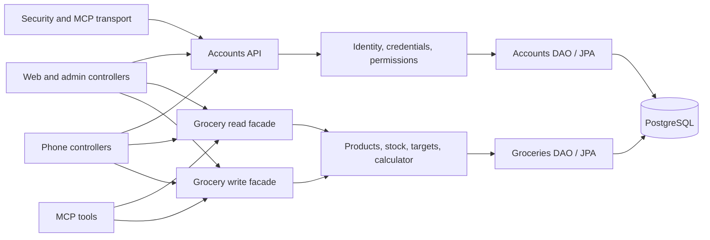
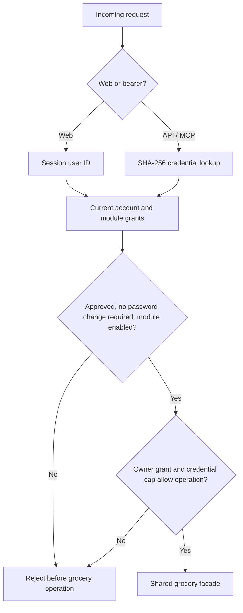
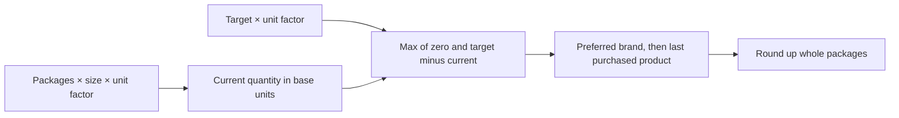

# Home Companion backend

Spring Boot application serving the Spanish web UI, administration, phone API and MCP from one process. Java 25 virtual threads are enabled; PostgreSQL stores shared household state.

## 1. Run locally

Prerequisites: **JDK 25 and a running PostgreSQL 18 database**. PostgreSQL is required: the schema and native queries depend on it; there is no H2 fallback. Java runs directly on your machine. Podman is optional if you already have PostgreSQL; the supplied development Compose starts only the database.

```sh
# From this folder; keep your existing .env if already configured:
cp -n .env.example .env
chmod 600 .env
# Set DB_PASSWORD and ADMIN_PASSWORD in .env.

# Optional: provision the development database with Podman.
# On macOS start your Podman machine first; install podman-compose.
PODMAN_COMPOSE_PROVIDER=podman-compose podman compose --env-file .env -f compose.dev.yaml up -d postgres
PODMAN_COMPOSE_PROVIDER=podman-compose podman compose --env-file .env -f compose.dev.yaml exec postgres pg_isready -U home_companion -d home_companion

# Once PostgreSQL is ready, start Java manually:
./mvnw spring-boot:run
```

With an existing PostgreSQL instance, create the `home_companion` database and a login role that owns it, then set `DB_URL`, `DB_USER` and `DB_PASSWORD` in `.env` to match. Flyway creates the application tables. The example URL uses the development container's loopback port `15432`; a native PostgreSQL installation usually uses `5432`. An unavailable database or invalid database credentials stop startup; the app never creates an alternative database.

1. Open [the web](http://localhost:8080/app).
2. Sign in with `ADMIN_USERNAME` and the `ADMIN_PASSWORD` you chose. Use `/app/login` for the web or `/admin/login` for administration; the login page links to both.
3. The admin can access all enabled modules immediately using the configured password. Password changes are optional through **Contraseña**. Changing `.env` later does **not** reset an existing database account; change its password through the web.
4. Open **Claves y dispositivos** to add users, approve registrations and assign `VIEW` or `EDIT` access to Despensa (the currently registered module). New users start pending with no module access. These controls are also available in administration.
5. Create a product in **Despensa**, set a target in **Cantidades objetivo**, and inspect **Lista de compras**.
6. Create an assistant key in **Claves y dispositivos**. Follow [MCP setup](docs/MCP.md).

Development uses loopback HTTP and non-secure cookies. Use [the Pi stack](../home-companion-pi/README.md) for household HTTPS access.

Stop Java with Ctrl+C. Stop the development database without deleting its data:

```sh
PODMAN_COMPOSE_PROVIDER=podman-compose podman compose --env-file .env -f compose.dev.yaml stop postgres
```

Java loads `.env` automatically from its **working directory**, including Maven, JAR and IDE launches. Run Maven in this backend folder; set the IDE working directory here too. Process environment, JVM system properties and command-line arguments override `.env`; `.env` overrides application configuration files. Single-quote values containing spaces, `#` or `$`. Values are literal: shell expansion and `${OTHER_VARIABLE}` interpolation are not supported in `.env`. No shell sourcing or helper script is needed. A missing file is allowed when all required properties are supplied externally; malformed files fail without printing their contents.

`.env.example` lists required secrets and application environment inputs. Keep your existing `.env`: launching Java never rewrites it or generates passwords. `SERVER_PORT` defaults to `8080`; adjust `HOME_ORIGIN` too if you change the browser port.

You can instead set `home.admin-password` in a private external Spring configuration file such as `config/application.properties`. Startup fails with a clear property error when the value is missing, blank, shorter than 12 characters or longer than 72 UTF-8 bytes—even with an existing database. Neither Java nor the setup scripts generate it. Never commit real passwords.

## 2. Architecture



> [!NOTE]
> This diagram shows ownership and shared use cases. A new delivery adapter reuses facades; it does not implement its own stock or permission rules. Spring Modulith verifies exactly six modules and their allowed dependencies.

| Package                            | Responsibility                                         |
| ---------------------------------- | ------------------------------------------------------ |
| `core.accounts.api`                | Account and access contracts                           |
| `core.accounts.internal`           | Identity, credential and permission rules              |
| `core.groceries.query`, `.command` | Read/write contracts and immutable values              |
| `core.groceries.internal`          | Product identity, exact quantities, stock and targets  |
| Each domain's `infrastructure`     | Parameterized JPA native persistence                   |
| `controllers.web`, `.phone`        | Forms / JSON adaptation                                |
| `security`                         | Separate web and bearer chains; request authentication |
| `mcp`                              | Four stateless tools and per-key concurrency control   |

Flyway creates the schema. Hibernate schema generation and Open EntityManager in View are disabled. Numeric quantities use `BigDecimal` and `numeric(12,3)`; negative stock is rejected by both the atomic update and a database constraint.

## 3. Access and accounts



> [!NOTE]
> The fresh database check explains why disabling an account, module, key or grant takes effect on the next request. MCP passes a verified permission callback into its worker context rather than relying on servlet thread-local state.

- Web: server-side session, 24-hour inactivity timeout, CSRF on writes, secure/HTTP-only/SameSite cookies in the Pi stack. Sessions end on process restart.
- Phone: `hs_sess_` opaque token, sliding 90-day expiry; cookies are ignored by the API.
- Agent: `hs_key_` key, groceries scope, fixed 365-day expiry, `READ` or `READ_WRITE` cap. Secret shown once; only hashes are stored.
- Admin pages require an approved administrator **web session**. Bearer credentials cannot access them or create keys.
- An administrator can use enabled modules through web/phone. Keys still require that administrator's explicit module grant.
- Registration creates a `PENDING` member. Allowed transitions: pending → approved/rejected; approved ↔ disabled. The last approved administrator cannot be removed.
- Password changes revoke bearer credentials. Login/registration are limited to 10 attempts per IP per minute; MCP permits four concurrent tool calls per key.

## 4. Groceries and shopping

Create an item independently when planning something never purchased. Quick-add also creates or reuses the item, brand and attributes in one transaction. Normalized names ignore case and accents. Product identity includes item, optional brand, sorted attributes, package size and unit.



> [!NOTE]
> This makes the quantity conversion visible: two 1 l cartons plus one 1.1 l carton equal 3.1 l. A 4 l target needs 0.9 l, or one suggested 1 l package. Grams and millilitres are never mixed.

Atomic increments avoid lost updates. REST `Idempotency-Key` and MCP `request_id` deduplicate additions for 24 hours per credential; changed content conflicts. The first result and stock update commit together. An hourly job deletes expired deduplication rows. Without a key, each addition is a new purchase; inspect stock before retrying a timed-out write.

## 5. Web components and palette

Server-rendered Thymeleaf forms work without JavaScript or a frontend build. Shared components live in `templates/fragments/layout.html`: brand, navigation, topbar, notes, empty states and quantity selectors. Styles and the house/book SVG mark are local assets.

| Token   | Color     | Use                               |
| ------- | --------- | --------------------------------- |
| Paper   | `#f6f1e7` | Warm page background              |
| Surface | `#fffdf8` | Cards and forms                   |
| Forest  | `#284e42` | Logo, primary actions and links   |
| Ink     | `#293b32` | Body and serif headings           |
| Clay    | `#994d32` | Section labels and keyboard focus |
| Brass   | `#806526` | Explanatory notes                 |

Use these CSS variables in new components. Preserve labelled controls, 44 px targets, visible focus, responsive layout and text status labels. Navigation strings live in `messages.properties`; the initial UI is Spanish.

[Desktop preview](docs/screenshots/home-desktop.png) · [Phone-width preview](docs/screenshots/home-mobile.png)

## 6. Phone API and MCP

The [OpenAPI contract](docs/openapi.json) inventories the phone-facing endpoints. No native iOS app is generated. Store phone tokens in Keychain when implementing that client later.

| Surface             | Address            |
| ------------------- | ------------------ |
| Web                 | `/app`             |
| Admin               | `/admin`           |
| Phone JSON API      | `/api/v1`          |
| Streamable HTTP MCP | `/mcp`             |
| Internal health     | `/actuator/health` |

See [MCP.md](docs/MCP.md) for client configurations, TLS trust, protocol compatibility, tool inputs and a connection check.

## 7. Configuration changes from defaults

| Setting                | Value / reason                                                                                                     |
| ---------------------- | ------------------------------------------------------------------------------------------------------------------ |
| Java / virtual threads | JDK 25; `spring.threads.virtual.enabled=true`, keep JVM alive                                                      |
| Bind address           | Loopback normally; `0.0.0.0` inside the private container network                                                  |
| JDBC pool              | 8 connections, 5-second acquisition timeout; virtual threads do not imply unlimited database work                  |
| Schema                 | Flyway only; `ddl-auto=none`, `open-in-view=false`                                                                 |
| Bootstrap              | Required owner-configured password, validated at startup; no forced admin password change; seed account only when users table is empty; restore all admin module grants at startup |
| Password hashing       | BCrypt cost 12; benchmark on the actual Pi before adjusting                                                        |
| Security               | Explicit surface policies, no remote auth, no grant cache                                                          |
| MCP                    | `STATELESS`, synchronous tools, resources/prompts/completions and unused annotation scanning disabled                                             |
| Actuator               | Health without details; info/metrics require admin session; Caddy blocks all actuator URLs                         |
| Runtime image          | Unprivileged UID 10001, Java heap ≤70% of container memory                                                         |
| Browser policy         | Same-origin assets, no remote fonts/scripts, no framing                                                            |

Secrets: `DB_PASSWORD`, `ADMIN_PASSWORD`. Other inputs: `DB_URL`, `DB_USER`, `ADMIN_USERNAME`, `SERVER_ADDRESS`, `SERVER_PORT`, `COOKIE_SECURE`, `HOME_ORIGIN`. Do not expose the application port directly on a LAN: forwarded headers are trusted because Caddy is the deployment boundary.

## 8. Minimal critical tests

```sh
./mvnw verify
./mvnw spotless:check
```

The critical tests cover the four shopping examples, key permission truth table, six-module boundaries, PostgreSQL concurrency/rollback, and the authenticated web/API/MCP flow. Integration tests require a real PostgreSQL 18 Testcontainer; unavailable containers fail the build instead of silently skipping it. No H2 or coverage-percentage target.

For rootless Podman on macOS, start the machine first. If Ryuk cannot access its socket, use `TESTCONTAINERS_RYUK_DISABLED=true ./mvnw verify`; the test explicitly stops its database container. Do not disable Ryuk on shared CI without equivalent cleanup.

Local verification passed on Java 25: critical tests, ARM64 container build, desktop/390 px browser rendering, web-issued MCP key connection and immediate revocation. Screenshots above come from the running application.

## 9. Implemented scope and design differences

This release delivers accounts/grants, product quick-add, stock adjustment, targets, shopping, keys, admin, web, phone endpoints and four MCP tools. It preserves the original architecture's single deployable and domain boundaries, with these explicit implementation choices:

- JPA uses parameterized native queries instead of entity/repository mapping; PostgreSQL constraints remain authoritative.
- One credential table distinguishes phone sessions and keys; categories are item labels. No empty image tables or unused filesystem volume are provisioned.
- Custom shared CSS replaces Bootstrap; full form posts currently need no htmx behavior.
- Stock tools use `query`, `limit` and `offset`; the broader category/brand/attribute filter contract and cursor pagination are not implemented.
- Catalogue merge/rename management, image uploads, exact-stock optimistic writes, custom key expiries and browser-session inventory are not implemented in this initial application.
- No audit history, backups, high availability or native iOS app, as requested. Deduplication is temporary operational state.
- Errors expose validation/conflict/auth failures; the original design's full fine-grained problem-type catalogue is not yet implemented.

Pinned versions: Boot 4.1.1, Modulith 2.1.1, Spring AI 2.0.1, MCP Java SDK 2.0.0, PostgreSQL 18.3. Boot's [Java compatibility](https://docs.spring.io/spring-boot/system-requirements.html) includes Java 25. The [Spring AI transport guide](https://docs.spring.io/spring-ai/reference/api/mcp/mcp-stateless-server-boot-starter-docs.html) documents the stateless WebMVC transport. Protocol limitations are stated in the MCP guide.
