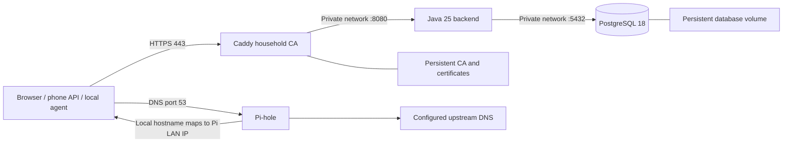
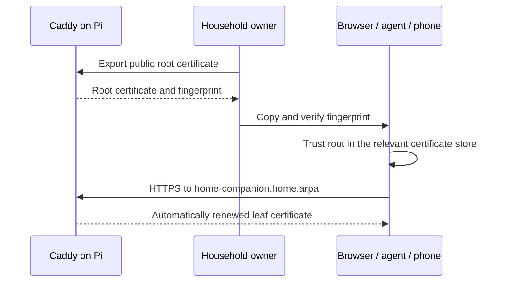

# Home Companion on Raspberry Pi

Podman Compose runs the backend, PostgreSQL, Caddy and Pi-hole on one household host. Target: Raspberry Pi 5 with 16 GB RAM and a **64-bit Debian-based OS**. Image manifests include ARM64 and AMD64; physical Pi performance and client trust must be checked on your hardware.

## 1. What runs where



> [!NOTE]
> The diagram explains which ports clients need and which stay private. Caddy is the only application ingress. Pi-hole resolves the household name; ordinary external DNS lookups use the chosen upstream resolver.

| Resource     | Configuration                             | Persistent state             |
| ------------ | ----------------------------------------- | ---------------------------- |
| Backend      | `compose.yaml`, backend `application.yml` | Database only                |
| PostgreSQL   | Environment, Flyway migrations            | `postgres-data`              |
| Caddy        | `Caddyfile`                               | `caddy-data`, `caddy-config` |
| Pi-hole      | `FTLCONF_*` environment                   | `pihole-data`                |
| Boot startup | Generated `home-companion.service`        | Installed systemd unit       |

No backup or high-availability service is included. Keep the CA volume: replacing it requires trusting a new root on every device.

## 2. Prepare the Pi

1. Install a supported 64-bit Raspberry Pi OS / Debian image, enable SSH and connect to your LAN.
2. Give the Pi a stable IPv4 address, preferably via a router DHCP reservation. With no router access, configure a static address appropriate for your subnet and outside its DHCP allocation; confirm the address is unused.
3. Record the Pi address and an upstream DNS server (usually the router). The upstream must not point to this Pi.
4. Install the packages:

```sh
sudo apt update
sudo apt install -y podman podman-compose git python3 curl openssl dnsutils
podman --version
podman-compose --version
uname -m  # must be aarch64 on the Pi
```

Use **rootful Podman** for this stack so it can bind ports 53, 80 and 443. All lifecycle commands below use `sudo`; mixing rootful and rootless commands creates separate deployments. The Java process inside its container still runs as UID 10001.

Check port availability before starting:

```sh
sudo ss -lntup
```

Resolve existing listeners on the Pi LAN address at 53/80/443 first. A resolver on `127.0.0.53` can usually coexist because this stack binds the explicit LAN address. Do not disable system DNS blindly. Keep router port forwarding and UPnP mappings for these services absent; do not publish them to the internet.

## 3. Configure this checkout

To build on the Pi, clone or copy the **whole repository**, keeping the two resource folders as siblings. To deploy an existing image, only `home-companion-pi` is needed; no JDK or Maven installation is required. Use a stable path without spaces, for example `/home/pi/home-companion`.

```sh
cd /home/pi/home-companion/home-companion-pi
python3 scripts/configure.py --lan-ip 192.168.1.50 --upstream-dns 192.168.1.1
```

Replace both example addresses. The script generates `.env` with database and Pi-hole passwords; permissions are `0600`. It leaves `ADMIN_PASSWORD` empty: set your own value (at least 12 characters, at most 72 UTF-8 bytes) before starting. No administrator password is generated. Compose rejects a missing or blank value; the application also validates it on every startup. The script refuses to overwrite an existing configuration. Review `.env` locally, optionally update `TZ`, and keep it out of Git.

Changing `DB_PASSWORD` after initialization requires changing the PostgreSQL role password too. Changing `ADMIN_PASSWORD` does not reset a previously created account. Use the web password page for that.

## 4. Choose an image and start

Compose runs the image selected by `BACKEND_IMAGE` in `.env` (default `localhost/home-companion:0.1.0`). It does not build Java automatically. Keep existing `.env` secrets; add or change only `BACKEND_IMAGE` when selecting a release. Choose one of these paths.

### A. Build a new image on the Pi

From `home-companion-pi`, with the backend folder alongside it:

```sh
sudo podman build --tag localhost/home-companion:0.1.0 ../home-companion-backend
```

Set `BACKEND_IMAGE=localhost/home-companion:0.1.0` in `.env`. The Dockerfile compiles with Java 25/Maven in a build stage and packages the application into a Java runtime image. Use a new tag for each release and set the matching value in `.env`. Native builds on a 64-bit Pi produce ARM64 images.

### B. Use an existing image

Set `BACKEND_IMAGE` in `.env` to your published image, for example `ghcr.io/YOUR_ACCOUNT/home-companion:YOUR_TAG` (replace both placeholders with an image you actually published). Choose an ARM64 image or a multi-platform manifest containing ARM64; an immutable digest also works. For a private registry, first run `sudo podman login REGISTRY`.

```sh
sudo ./scripts/compose.sh pull backend
```

For an image archive instead, load it with `sudo podman load --input /path/to/home-companion.tar`, then set `BACKEND_IMAGE` to the loaded tag. Skip the pull for a locally loaded image. To prepare an archive on another ARM64 machine, build it there and run `podman save --output home-companion.tar localhost/home-companion:0.1.0`, then copy the archive to the Pi. An AMD64 build host needs an ARM64 builder or configured emulation.

### Start the stack

Both paths use the same commands:

```sh
sudo ./scripts/compose.sh up -d
sudo ./scripts/compose.sh ps
sudo ./scripts/compose.sh logs --tail=80 backend
```

PostgreSQL is required; Compose supplies it and persists its data. There is no H2 fallback. For development outside containers, use the [manual Maven workflow](../home-companion-backend/README.md#1-run-locally).

The first build needs internet to download dependencies and images. The backend has no outbound network at runtime: it joins only the internal network. Pi-hole and Caddy join the edge network; Caddy issues certificates locally rather than contacting a public certificate authority.

Database health precedes backend startup; backend health precedes Caddy. A first build may take several minutes. Confirm backend health before proceeding. PostgreSQL 18 stores its versioned data directory under the mounted `/var/lib/postgresql` parent.

Enable startup after reboot:

```sh
sudo ./scripts/install-service.sh
sudo systemctl status home-companion --no-pager
```

The installer writes a systemd unit pointing at this checkout, then enables it. Keep the checkout at that path. Unit startup runs `up -d`; shutdown stops containers without deleting volumes. Podman handles process restarts through `unless-stopped`.

## 5. Configure DNS

Pi-hole already has this local record from Compose:

```text
home-companion.home.arpa → LAN_IP
```

Check it from another LAN device:

```sh
dig @192.168.1.50 home-companion.home.arpa +short
```

Then select the Pi as the device's DNS server:

- **iPhone:** Settings → Wi-Fi → your network → Configure DNS → Manual. Add the Pi address and remove other resolvers for this network.
- **macOS:** System Settings → Network → active connection → Details → DNS. Add the Pi address.
- **Other clients:** Set the network DNS server to the Pi. Browser Secure DNS / DNS-over-HTTPS may bypass it; use system DNS for this household name.
- **Router later:** Advertise Pi DNS via DHCP when router configuration is available.

Do not add a public secondary DNS expecting it to resolve this local hostname. For this single-host scope, stopping the Pi also stops clients' configured DNS; manually restore ordinary DNS when taking it offline.

### Pi-hole administration

Its admin port is bound only to Pi loopback. From your laptop:

```sh
ssh -L 8081:127.0.0.1:8081 pi@192.168.1.50
```

Open `http://localhost:8081/admin/` through the SSH tunnel; sign in with `PIHOLE_PASSWORD` from `.env`. The Home Companion admin is a different page at `/admin` on its HTTPS hostname. Settings controlled by `FTLCONF_*` environment variables must be changed in Compose, then recreated; the Pi-hole UI cannot override those values permanently.

## 6. Export and trust the household CA

```sh
sudo ./scripts/export-ca.sh
```

This exports only `certificates/home-companion-root.crt` and prints its SHA-256 fingerprint. Copy that public certificate to each client over SSH or another trusted local channel. Compare fingerprints before trusting it. Never copy the Caddy CA private key.



> [!NOTE]
> This separates one-time root trust from automatic leaf renewal. Browser trust and an agent process's trust store may differ; test both.

- **macOS:** Import into Keychain Access, select the household root and configure SSL trust. Verify the fingerprint first.
- **iPhone:** Transfer the certificate, install the downloaded profile under Settings → General → VPN & Device Management, then enable full trust under General → About → Certificate Trust Settings. This supports Safari now; no native app is included.
- **Debian/Ubuntu client:** Copy the `.crt` into `/usr/local/share/ca-certificates/`, then run `sudo update-ca-certificates`.
- **Node agent:** Set `NODE_EXTRA_CA_CERTS` to the absolute certificate path before launching the process.
- **Other agent clients:** Configure their documented custom CA path or use the OS trust store they support. Do not disable verification.

Check TLS independently of login:

```sh
curl --cacert certificates/home-companion-root.crt https://home-companion.home.arpa/app/login
```

## 7. Use the application

1. Open **https://home-companion.home.arpa/app**.
2. Log in as `ADMIN_USERNAME` with the `ADMIN_PASSWORD` you chose in `.env`. The web login is `/app/login`; the administration login is `/admin/login`.
3. Change the bootstrap password when prompted. An admin login then returns to `/admin`.
4. Open **https://home-companion.home.arpa/admin**. Approve registered members and grant pantry access.
5. Add products, set targets and inspect the shopping list.
6. Create a groceries key on the web and follow the [MCP connection guide](../home-companion-backend/docs/MCP.md).

The phone contract is [OpenAPI](../home-companion-backend/docs/openapi.json). The same HTTPS origin serves all surfaces.

## 8. Non-default component settings

| Component       | Change                                                                   | Why                                                      |
| --------------- | ------------------------------------------------------------------------ | -------------------------------------------------------- |
| Images          | Exact registry digests, ARM64/AMD64 manifests verified                   | Reproducible base images                                 |
| Podman          | Explicit `podman-compose` provider, rootful host runtime                 | Predictable Compose behavior and privileged LAN ports    |
| Network         | Published ports bind `LAN_IP`; database/app internal only                | No direct database or Java access                        |
| Backend         | UID 10001, read-only root, private tmpfs, no capabilities, 1.5 GiB limit | Bound resources and writable locations                   |
| Java            | Virtual threads; heap ≤70%; eight JDBC connections                       | Efficient blocking I/O with bounded database concurrency |
| PostgreSQL      | Named database/user, private port, 128 MiB shared memory, 768 MiB limit  | Small household deployment                               |
| Caddy           | Internal CA, admin API off, HTTP/1.1+2, actuator hidden, 64 KiB requests | Local TLS and limited exposed surface                    |
| Pi-hole         | Local host record, explicit upstream, listen on container interfaces     | Resolve the household name through container networking  |
| Pi-hole privacy | Query logging off, database retention 0 days, privacy level 3            | Avoid retaining household DNS history                    |
| Logs            | Podman `k8s-file`, 10 MB cap per container                               | Bound local log storage; no audit subsystem              |
| Startup         | systemd oneshot + Compose + container restart policies                   | Start after network, preserve data on stop               |

Image digests are pinned, so `pull` alone does not upgrade versions. Deliberately update the pins after testing a release.

## 9. Operate and update

```sh
sudo ./scripts/compose.sh ps
sudo ./scripts/compose.sh logs --tail=100 backend
sudo ./scripts/compose.sh exec postgres pg_isready -U home_companion -d home_companion
sudo systemctl stop home-companion
sudo systemctl start home-companion
```

For an application update, build a new tagged image (path A) or select and pull a published release (path B), update `BACKEND_IMAGE` in `.env`, then run:

```sh
sudo ./scripts/compose.sh up -d
```

Flyway migrations run at startup. Make future migrations backward-compatible; an older image does not undo a schema change. Never use `down -v` on a deployment whose data you intend to keep. Moving this stack to another host does not transfer its volumes.

## 10. Acceptance checklist

The complete stack was smoke-tested on ARM64 Podman on macOS: backend/database health, Pi-hole DNS, verified Caddy TLS and blocked actuator access. Alternate loopback ports were used for that test. The physical Pi and client trust steps below still require your device setup.

- Web and admin work from a laptop and an iPhone on Wi-Fi without TLS warnings.
- Four MCP tools list from the chosen client; a READ key cannot add stock.
- Revoking a key or removing a grant denies its next request.
- Data and Caddy root survive container recreation and a host reboot.
- Only intended LAN ports are reachable; database/Java ports are closed externally.
- Check temperature, memory and BCrypt latency on the physical Pi under normal use.

Sources: [Podman Compose provider](https://docs.podman.io/en/latest/markdown/podman-compose.1.html), [Pi-hole container configuration](https://docs.pi-hole.net/docker/), [Caddy local HTTPS](https://caddyserver.com/docs/automatic-https#local-https).
